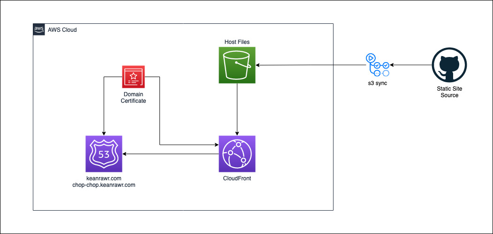

# Infrastructure as Code

I'm a big fan of the idea of IAC, however, I'm not really good at it. My set of skills tend to focus on development. But I can't deny the importance that infrsastructure has.

This is the terraform code to generate an aws stack to host an static website, this will host the [static site for ChopChop and Norberto](https://github.com/keanrawr/chop-chop), one of my github projects.

The site is available at [chop-chop.keanrawr.com](https://chop-chop.keanrawr.com).

## Architecture

This is a simple implementation of a very popular static hosting architecture in aws:

- S3 to host the website files
- CloudFront to serve the files without having to enable public access to our bucket
- Route 53 for our domain
- Certificate manager for our domain's certificate

We'll also be using github actions to sync the contents in our S3 buckets, with the changes that there are in the repo for the static site.

## Next steps

- [ ] Host the terraform state file in aws
- [ ] github action to apply changes
